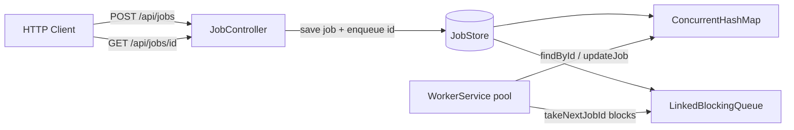

# Job Queue API

A Spring Boot REST service that accepts asynchronous work submissions, processes them in a background worker pool, and exposes job status via HTTP.

Built for the DigitalOcean backend orchestration interview exercise: async processing, concurrent state management, testing, CI/CD, and App Platform deployment.

## Architecture



### Request flow

1. **POST /api/jobs** — validates payload, creates a `QUEUED` job, saves to the store, enqueues the job ID, returns **202 Accepted** immediately.
2. **WorkerService** — N threads block on `takeNextJobId()`, transition jobs to `RUNNING`, simulate work, then mark `COMPLETED` or `FAILED` (with retry).
3. **GET /api/jobs/{id}** — returns current job state from the in-memory store.

### Why 202 Accepted (not 201 Created)?

- **201** implies the resource exists in its final form.
- **202** means the request is **accepted for processing** but not finished yet.

The client receives a `jobId` and polls until the job reaches a terminal state (`COMPLETED` or `FAILED`).

## Tech stack

- Java 17, Spring Boot 3.4
- In-memory `ConcurrentHashMap` + `LinkedBlockingQueue`
- Background worker pool (`WorkerService`)
- Spring Boot Actuator (`/actuator/health`)
- JUnit 5, MockMvc, Mockito, AssertJ

## Prerequisites

- Java 17+
- Maven (or use included `./mvnw`)
- Docker / OrbStack (optional, for container builds)
- [doctl](https://docs.digitalocean.com/reference/doctl/) (for DigitalOcean deployment)

## Run locally

```bash
./mvnw spring-boot:run
```

Health check:

```bash
curl -s http://localhost:8080/actuator/health; echo
```

### Submit a job (202 Accepted)

```bash
curl -s -X POST http://localhost:8080/api/jobs \
  -H "Content-Type: application/json" \
  -d '{"payload":"process customer export"}' | python3 -m json.tool
```

Example response:

```json
{
  "jobId": "550e8400-e29b-41d4-a716-446655440000",
  "status": "QUEUED"
}
```

### Poll job status

```bash
curl -s http://localhost:8080/api/jobs/JOB_ID | python3 -m json.tool
```

### List all jobs (debugging)

```bash
curl -s http://localhost:8080/api/jobs | python3 -m json.tool
```

## Configuration

All settings are driven by environment variables:

| Variable | Default | Description |
|----------|---------|-------------|
| `PORT` | `8080` | HTTP port |
| `WORKER_POOL_SIZE` | `3` | Background worker threads |
| `MAX_ATTEMPTS` | `3` | Max processing attempts per job |
| `WORK_SLEEP_MIN_MS` | `2000` | Min simulated work duration |
| `WORK_SLEEP_MAX_MS` | `5000` | Max simulated work duration |
| `FAILURE_RATE_PERCENT` | `30` | Simulated transient failure rate |
| `LOG_LEVEL` | `INFO` | Application log level |

Example:

```bash
WORKER_POOL_SIZE=5 FAILURE_RATE_PERCENT=0 ./mvnw spring-boot:run
```

## Run tests

```bash
./mvnw test
```

Test coverage:

- **JobStoreTest** — map/queue behavior, blocking `take()`, concurrent saves
- **WorkerServiceTest** — success, retry, and permanent failure flows
- **JobControllerIntegrationTest** — API endpoints, full async flow, concurrency

## Docker

Build and run:

```bash
docker build -t job-queue-api .
docker run -p 8080:8080 \
  -e WORKER_POOL_SIZE=3 \
  -e FAILURE_RATE_PERCENT=0 \
  job-queue-api
```

## CI/CD

GitHub Actions runs on every push/PR to `main`:

- `./mvnw test`
- `./mvnw package`

Workflow file: [`.github/workflows/ci.yml`](.github/workflows/ci.yml)

## Deploy to DigitalOcean App Platform

### 1. Push to GitHub

```bash
git init
git add .
git commit -m "Add async job queue API"
git remote add origin https://github.com/YOUR_GITHUB_USER/job-queue-api.git
git push -u origin main
```

### 2. Update app spec

Edit [`.do/app.yaml`](.do/app.yaml) and replace `YOUR_GITHUB_USER/job-queue-api` with your repository.

### 3. Authenticate doctl

```bash
doctl auth init
doctl account get
```

### 4. Create the app

```bash
doctl apps create --spec .do/app.yaml
```

### 5. Verify deployment

```bash
doctl apps list
doctl apps logs APP_ID --type run --follow
```

Test the live URL:

```bash
curl -s -X POST https://YOUR-APP.ondigitalocean.app/api/jobs \
  -H "Content-Type: application/json" \
  -d '{"payload":"production smoke test"}'; echo
```

### Update after changes

```bash
git push origin main   # autodeploy if enabled
# or
doctl apps update APP_ID --spec .do/app.yaml
```

## API reference

| Method | Path | Status | Description |
|--------|------|--------|-------------|
| `POST` | `/api/jobs` | 202 | Submit work, returns `jobId` |
| `GET` | `/api/jobs/{id}` | 200 / 404 | Get job status and result |
| `GET` | `/api/jobs` | 200 | List all jobs |
| `GET` | `/actuator/health` | 200 | Health check for load balancers |

### Error response format

```json
{
  "error": "Job not found: abc-123",
  "jobId": "abc-123"
}
```

## Known limitations

- **In-memory storage** — jobs are lost on restart or redeploy
- **Single instance** — no shared state across horizontally scaled replicas
- **No authentication** — API is open by default
- **Simulated work** — random sleep + random failures, not real external integration
- **At-least-once queue semantics** — retries re-enqueue job IDs; production would need idempotency keys

## Production next steps

- Persist jobs in **PostgreSQL** or queue in **Valkey/Redis**
- Split **API** and **worker** into separate App Platform components
- Add structured metrics (queue depth, failure rate, processing latency)
- Dead-letter queue for permanently failed jobs
- Idempotency keys on `POST /api/jobs`

## Project structure

```
src/main/java/com/example/jobqueue/
├── controller/     # REST API
├── service/        # JobService, WorkerService
├── store/          # JobStore (map + queue)
├── model/          # Job, JobStatus
├── dto/            # Request/response objects
├── config/         # AppProperties, Jackson, workers
└── exception/      # GlobalExceptionHandler
```
